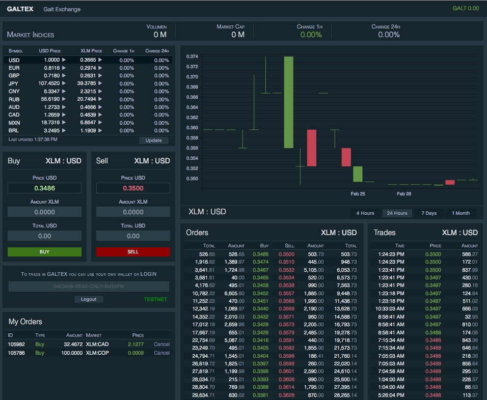

# GaltEx - Galt Exchange

GaltEx is the most innovative exchange for crypto assets built on top of SDEX - Stellar Decentralized Exchange. 

It allows you to trade in four different markets: 

- **Forex** will allow you to trade in more than a hundred world currencies
- **Crypto** will list the top hundred crypto currencies like Bitcoin and Ethereum
- **Wall St.** will list the top hundred stocks from Dow Jones and Nasdaq
- **Galt St.** will list all assets created by startups on the Stellar Network

In order to use GaltEx all you need to have is a Stellar account. You can buy and sell assets from your own wallet or you can login with your public key to track your orders. Keys are never stored or transmitted anywhere. We advise you to never share your secret keys in websites or apps you don't trust.

**GaltEx** is part of the financial services provided by **GaltBank**, they first crypto bank in the world with the most advanced and feature rich desktop and mobile wallets. **GaltBank** also offers payment services for your shopping needs so you can trade, shop and save with confidence backed by the most trusted bank on the blockchain.

## Credits

**GaltEx** uses the following external libraries:

StellarSDK - https://github.com/stellar/js-stellar-sdk
Techan.js - https://github.com/andredumas/techan.js/
D3.js - https://github.com/d3/d3